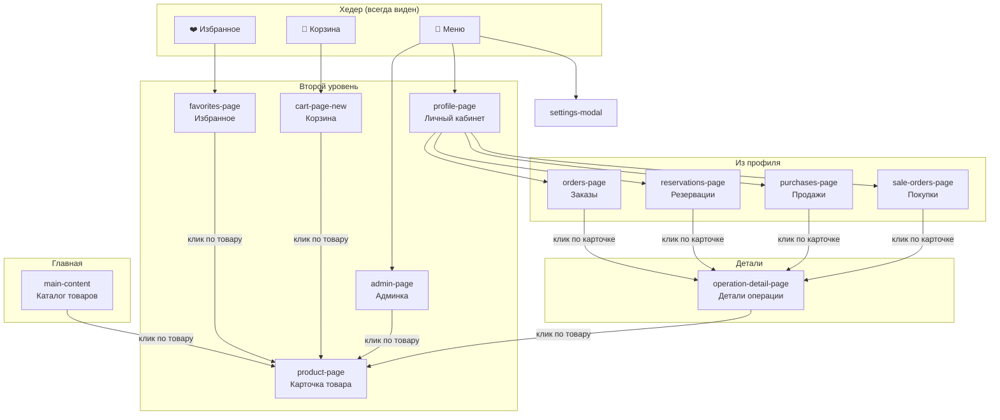
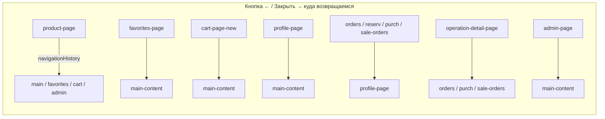
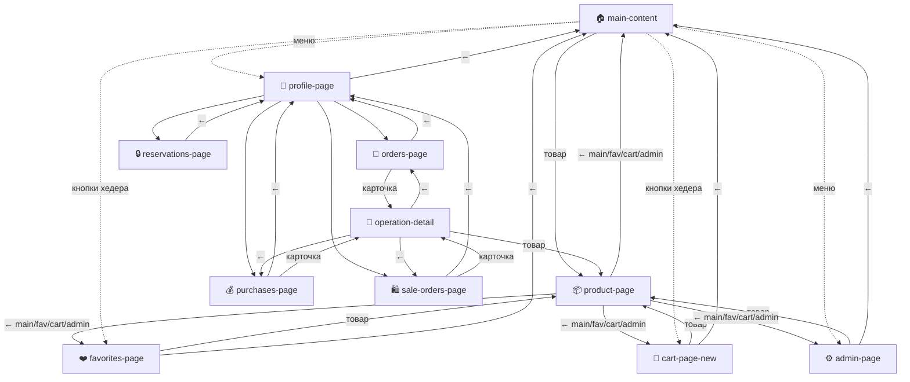

# Схема навигации веб-приложения Прайс

## 1. Блоки-страницы (экраны)

```
┌─────────────────────────────────────────────────────────────────────────────┐
│  main-content          Главная: каталог, категории, сетка товаров           │
├─────────────────────────────────────────────────────────────────────────────┤
│  product-page          Карточка товара (полноэкранная)                      │
├─────────────────────────────────────────────────────────────────────────────┤
│  favorites-page        Избранное                                            │
├─────────────────────────────────────────────────────────────────────────────┤
│  cart-page-new         Корзина (новая)                                      │
├─────────────────────────────────────────────────────────────────────────────┤
│  profile-page          Личный кабинет                                       │
├─────────────────────────────────────────────────────────────────────────────┤
│  orders-page           Заказы (из профиля)                                  │
│  reservations-page    Резервации                                            │
│  purchases-page        Продажи (заявки на продажу)                           │
│  sale-orders-page      Покупки                                              │
├─────────────────────────────────────────────────────────────────────────────┤
│  operation-detail-page Детали одной операции (заказ/покупка/продажа)        │
├─────────────────────────────────────────────────────────────────────────────┤
│  admin-page            Админка                                              │
└─────────────────────────────────────────────────────────────────────────────┘
```

В каждый момент видна только одна страница (остальные `display: none`).

---

## 2. Точки входа и переходы (граф)



---

## 3. Куда ведёт «Назад» (закрытие)



| Страница | Кнопка закрытия | Возврат |
|----------|-----------------|---------|
| **product-page** | ← | По `navigationHistory`: main / favorites / cart / admin |
| **favorites-page** | ← | main-content |
| **cart-page-new** | ← | main-content |
| **profile-page** | ← | main-content |
| **orders-page**, **reservations-page**, **purchases-page**, **sale-orders-page** | ← | profile-page |
| **operation-detail-page** | ← | Та же страница списка (orders / purchases / sale-orders) |
| **admin-page** | ← Назад | main-content |

---

## 4. Блок-схема «кто откуда открывается»

```
                    ┌──────────────┐
                    │   HEADER     │
                    │  🍔 🛒 ❤️    │
                    └──┬─────┬──┬──┘
                       │     │  │
         ┌─────────────┼─────┼──┼─────────────┐
         │             │     │  │             │
         ▼             ▼     ▼  ▼             ▼
    ┌─────────┐   ┌──────────────┐     ┌──────────┐
    │ Profile │   │ cart-page-   │     │ favorites │
    │ Admin   │   │    new       │     │  -page    │
    │ Settings│   └──────┬───────┘     └─────┬─────┘
    └────┬────┘          │                   │
         │               │                   │
         │          ┌────┴────┐         ┌────┴────┐
         │          │  main-   │◄────────│  main-  │
         │          │ content  │  close  │ content │
         │          └────┬────┘         └─────────┘
         │               │
         │               │ click product
         │               ▼
         │          ┌─────────────┐
         │          │ product-    │
         │          │   page      │
         │          └──────┬──────┘
         │                 │ close → navigationHistory
         │                 │ (main | favorites | cart | admin)
         │                 │
         ▼                 │
    ┌─────────────┐        │
    │ profile-    │        │
    │   page      │        │
    └──────┬──────┘        │
           │               │
           │  [Заказы]     │
           │  [Резервации] │
           │  [Продажи]    │
           │  [Покупки]    │
           ▼               │
    ┌─────────────────────┴──────┐
    │ orders / reservations /    │
    │ purchases / sale-orders     │
    └──────┬─────────────────────┘
           │ click card
           ▼
    ┌──────────────────┐
    │ operation-detail- │──────► product-page (click product in deal)
    │      page         │
    └──────┬────────────┘
           │ back
           ▼
    (соответствующая страница списка)
```

---

## 5. Единое правило открытия страниц

**Любая функция, открывающая страницу, ОБЯЗАНА сначала вызвать `hideAllPages()` из `operationsBase.js`, затем показать свою страницу.**

- `hideAllPages()` — скрывает ВСЕ контейнеры из `ALL_PAGE_IDS` (main-content, product-page, favorites-page, cart-page, cart-page-new, profile-page, orders/reservations/purchases/sale-orders-page, sale-order-page, operation-detail-page, admin-page).
- Используют: `openFavoritesPage`, `openProfile`, `openCartPageNew`, `openOperationPage`, `openOperationDetailPage`, `openAdmin`, `showProductModal`, `showSaleOrderModal`.

Так устраняются наложения экранов и «избранное не открывается с первого клика».

---

## 6. Файлы, где живёт логика

| Действие | Файл | Функции |
|----------|------|---------|
| Список страниц, hideAllPages, открыть/закрыть страницу операций | `js/operationsBase.js` | `ALL_PAGE_IDS`, `hideAllPages()`, `showOnlyPage()`, `openOperationPage`, `closeOperationPage` |
| Страница товара, «назад» по истории | `js/handlers/products_modal.js` | `showProductModal`, `closeProductPage`, `navigationHistory` |
| Профиль | `js/profile.js` | `openProfile`, `closeProfilePage` |
| Избранное | `js/favorites.js` | `openFavoritesPage`, `closeFavoritesPage` |
| Корзина | `js/cart/cartNew.js` | `openCartPageNew`, `closeCartPageNew` |
| Детали операции | `js/operationsDetail.js` | `openOperationDetailPage`, `closeOperationDetailPage`, `currentListPageId` |
| Меню, админка | `js/menu.js`, `js/admin.js`, `js/handlers/admin_init.js` | `openAdmin`, `closeAdminPage` |

---

## 7. Модель в одну картинку (Mermaid)



---

*Документ: `docs/NAVIGATION_SCHEMA.md`*
